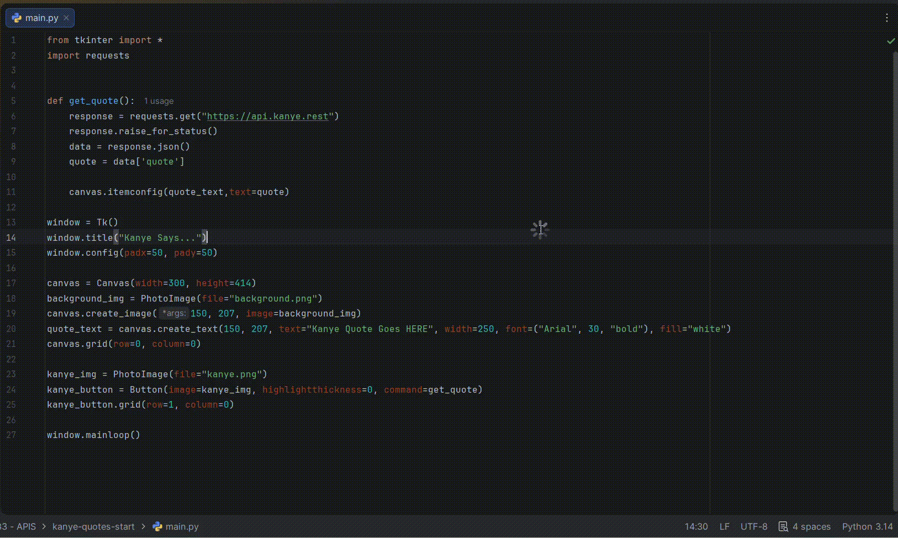

# Kanye Says

A simple GUI application built with Python and `tkinter` that displays random Kanye West quotes using the [Kanye REST API](https://api.kanye.rest).

## Demo



## How It Works

1. Run the application.
2. A Kanye quote appears on the quote card.
3. Click the Kanye image button.
4. The app requests a new random quote from the API and updates the screen.

## Tech Used

- Python
- `tkinter` — for the graphical interface
- `requests` — to fetch quotes from the API
- Kanye REST API

## Project Files

```text
project-folder/
├── main.py
├── background.png
├── kanye.png
└── demo/
    └── demo.gif
```

Make sure `background.png` and `kanye.png` are in the same folder as `main.py`.

## Run It Locally

Install the required package:

```bash
pip install requests
```

Then run the application:

```bash
python main.py
```

## Notes

The application needs an internet connection because it fetches a new quote from:

```text
https://api.kanye.rest
```
