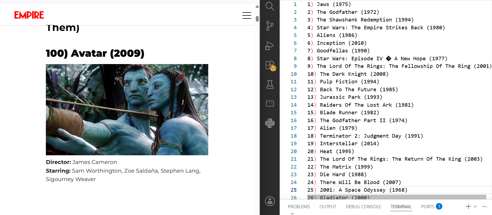

# Top 100 Movies Scraper
A simple and lightweight web scraping tool built with Python's `requests` and `BeautifulSoup` libraries. It fetches Empire's "100 Greatest Movies Ever Made" list and saves all the movie titles to a text file, in order from #1 to #100.



## How It Works
1. The script sends a request to Empire Online's best movies page and retrieves the page's HTML.
2. `BeautifulSoup` parses the HTML and selects each movie title from the `<h2>` headings.
3. The titles are reversed into #1-to-#100 order and written to `top 100 movies of all time.txt`.

## Tech Used
- Python
- `requests` (for fetching web pages)
- `BeautifulSoup` (for parsing HTML)

## Run It Locally
```bash
pip install requests beautifulsoup4
python main.py
```

## License
Feel free to use, modify, or build on this project.
