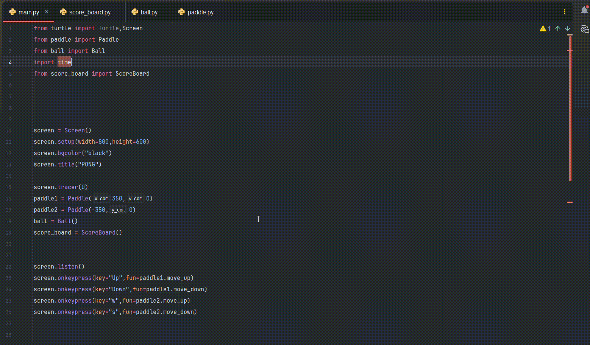

# Pong Game
A classic two-player Pong game built with Python's `turtle` module. Control your paddle with keyboard keys, rally the ball back and forth, and score points when your opponent misses.



## How It Works
1. Two paddles start on opposite sides of the screen — left and right.
2. Player 1 (right paddle) moves with the **Up** and **Down** arrow keys.
3. Player 2 (left paddle) moves with the **W** and **S** keys.
4. The ball bounces off the top and bottom walls, and off either paddle.
5. If the ball passes a paddle and hits the side wall, the opposing player scores a point.
6. The ball speeds up slightly with each paddle hit, making rallies progressively harder.
7. There's no fixed win condition — play until you're tired, or add your own point limit.

## Controls
| Player | Move Up | Move Down |
|--------|---------|-----------|
| Right paddle | Up arrow | Down arrow |
| Left paddle | W | S |

## Tech Used
- Python
- `turtle` (standard library)

## Run It Locally
```bash
python main.py
```
No external dependencies required — just a standard Python installation.

## License
Feel free to use, modify, or build on this project.
