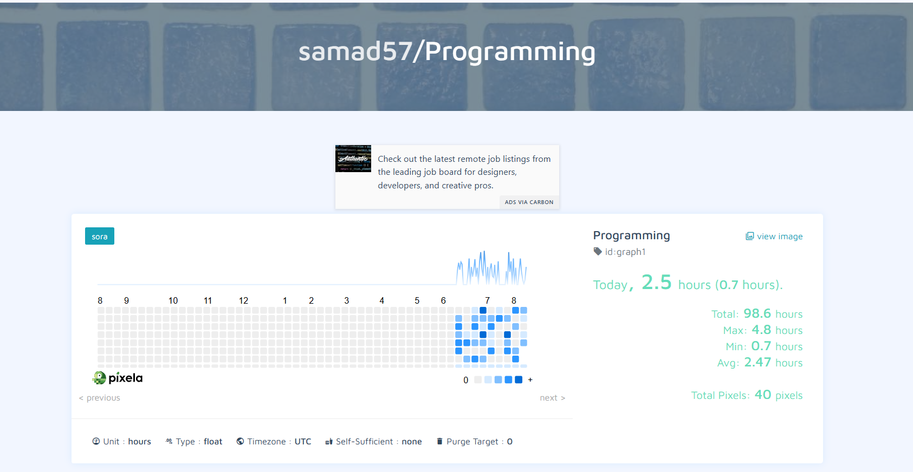

# Pixel Habit Tracker
A simple habit tracker built with Python and the [Pixela](https://pixe.la) API. Log daily stats like hours spent programming and watch them build up into a GitHub-style contribution graph.



## How It Works
1. Register a Pixela account by running the account-creation request once (with your own token and username).
2. Create a graph to track your data — set its name, unit, and color.
3. Each day, run the pixel request to log that day's quantity (e.g. hours spent programming) to your graph.
4. View your graph on Pixela's site to see your activity build up over time.

## Tech Used
- Python
- `requests`

## Run It Locally
```bash
python main.py
```
Set `PIXELA_TOKEN` and `PIXELA_USERNAME` at the top of the script before running. No external dependencies beyond `requests` are required.

## License
Feel free to use, modify, or build on this project.
