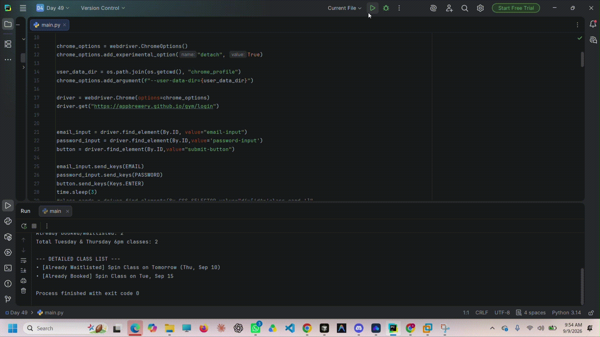

# Selenium Gym Class Booker

A Python Selenium automation bot that logs into a gym scheduling website and automatically processes all Tuesday and Thursday classes scheduled for 6:00 PM.

The bot can book available classes, join waitlists for full classes, recognize existing bookings, and display a detailed booking summary.

## Demo



## Features

- Automated login using Selenium
- Finds all Tuesday and Thursday 6:00 PM classes
- Books classes with available spaces
- Joins the waitlist when a class is full
- Detects classes that are already booked
- Detects classes where the user is already waitlisted
- Tracks booking and waitlist statistics
- Prints a detailed class-processing summary
- Uses a persistent Chrome profile
- Keeps Chrome open after the script finishes

## How It Works

1. Selenium opens the gym login page.
2. The bot enters the user's email and password.
3. After logging in, it waits for the class schedule to load.
4. It finds all class cards using their shared ID pattern.
5. For every class card, it reads:
   - Class name
   - Class time
   - Day and date
   - Current booking status
6. It processes classes scheduled for Tuesday or Thursday at 6:00 PM.
7. Depending on the button state, the bot:
   - Books the class
   - Joins the waitlist
   - Recognizes an existing booking
   - Recognizes an existing waitlist entry
8. Finally, it prints a complete booking summary.

## Example Output

```text
✓ Already booked: Spin Class on Tue, Aug 12
✓ Joined waitlist for: Yoga Class on Thu, Aug 14

--- BOOKING SUMMARY ---
New bookings: 0
New waitlist entries: 1
Already booked/waitlisted: 1
Total Tuesday & Thursday 6pm classes: 2

--- DETAILED CLASS LIST ---
• [Already Booked] Spin Class on Tue, Aug 12
• [New Waitlist] Yoga Class on Thu, Aug 14
```

## Technologies Used

- Python 3
- Selenium WebDriver
- Google Chrome
- ChromeDriver
- CSS selectors
- XPath selectors

## Requirements

- Python 3.x
- Google Chrome
- Selenium

Install Selenium using:

```bash
pip install selenium
```

Modern versions of Selenium can usually manage ChromeDriver automatically.

## Running the Project

1. Clone the repository:

```bash
git clone https://github.com/YOUR-USERNAME/selenium-gym-class-booker.git
```

2. Open the project directory:

```bash
cd selenium-gym-class-booker
```

3. Install Selenium:

```bash
pip install selenium
```

4. Add your login details to the Python script:

```python
EMAIL = "your-email@example.com"
PASSWORD = "your-password"
```

5. Run the program:

```bash
python main.py
```

## Project Structure

```text
selenium-gym-class-booker/
├── main.py
├── demo/
│   └── demo.gif
├── .gitignore
└── README.md
```

## Selenium Selectors

The website uses IDs with a shared naming pattern:

```html
<div id="class-card-123">
<p id="class-time-123">
<h3 id="class-name-123">
<button id="book-button-123">
```

Because the numbers can change, the bot uses CSS selectors that match IDs by their beginning:

```python
"div[id^='class-card-']"
"p[id^='class-time-']"
"h3[id^='class-name-']"
"button[id^='book-button-']"
```

The `^=` operator means:

> Select an element whose attribute starts with this value.

The class date is stored in an ancestor element, so XPath is used to move upward from the class card:

```python
"./ancestor::div[starts-with(@id, 'day-group-')][1]"
```

## Booking States

The bot handles four possible button states:

| Button text | Bot action |
|---|---|
| `Book Class` | Books the class |
| `Join Waitlist` | Joins the waitlist |
| `Booked` | Reports that the class is already booked |
| `Waitlisted` | Reports that the user is already waitlisted |

## Persistent Chrome Profile

The program uses a local Chrome profile:

```python
user_data_dir = os.path.join(os.getcwd(), "chrome_profile")
chrome_options.add_argument(f"--user-data-dir={user_data_dir}")
```

This allows browser data to remain available between runs.

The `chrome_profile` directory should not be committed to GitHub. Add it to `.gitignore`:

```gitignore
chrome_profile/
__pycache__/
*.pyc
.env
```

## Security Notice

Do not upload real passwords or private login credentials to GitHub.

For a public repository, replace your credentials with placeholders:

```python
EMAIL = "your-email@example.com"
PASSWORD = "your-password"
```

If you accidentally commit a real password, change the password immediately and remove it from the repository's Git history.

## Notes

- The bot currently targets Tuesday and Thursday classes at 6:00 PM.
- The target days and time can be changed in the script.
- The gym website must be accessible for the automation to work.
- Chrome remains open after the program finishes because the detach option is enabled.
- This project is intended for practicing Selenium, CSS selectors, XPath, loops, conditions, and browser automation.

## License

This project is available for educational and personal use.
````
