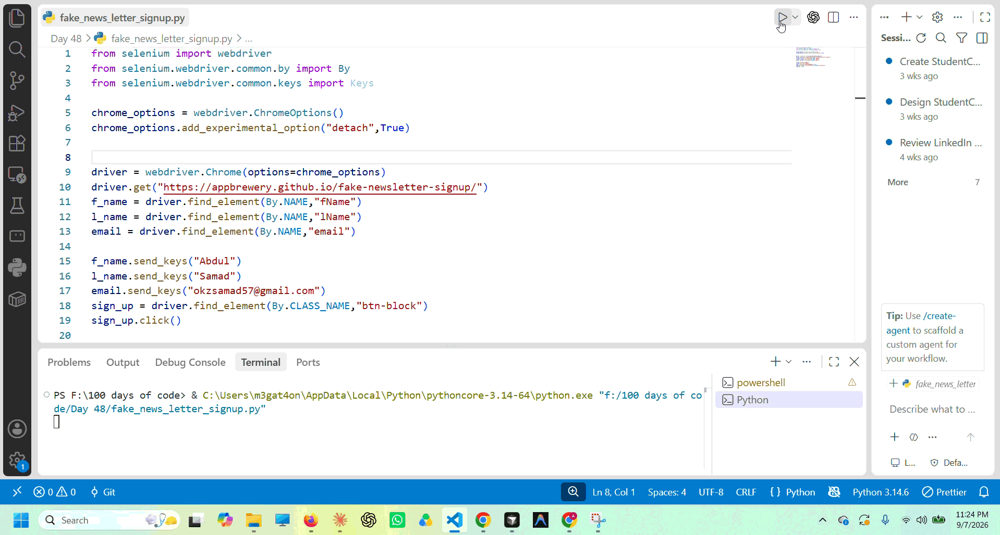

# Selenium Newsletter Signup Automation

A simple web automation project built with Python and Selenium WebDriver. The script automatically opens a newsletter signup page, fills in the user's first name, last name, and email address, and submits the form.

## How It Works

1. The script launches Google Chrome using Selenium WebDriver.
2. It opens the newsletter signup webpage.
3. It locates the first name, last name, and email fields.
4. It automatically enters the provided information.
5. The script clicks the **Sign Up** button to submit the form.

## Tech Used

- Python
- Selenium
- Google Chrome
- Chrome WebDriver

## Run It Locally

Install Selenium first:

    pip install selenium

Then run the script:

    python main.py

The script will automatically open Chrome and submit the newsletter signup form.

## Learning Objectives

This project demonstrates basic Selenium concepts including:

- Launching a browser with Selenium
- Finding web elements using `By.NAME` and `By.CLASS_NAME`
- Entering text using `send_keys()`
- Clicking buttons using `click()`
- Automating web form submission

## Project Structure

    selenium-newsletter-signup-automation/
    ├── main.py
    ├── README.md
    └── demo/
        └── demo.gif

## License

Feel free to use, modify, or build on this project.
