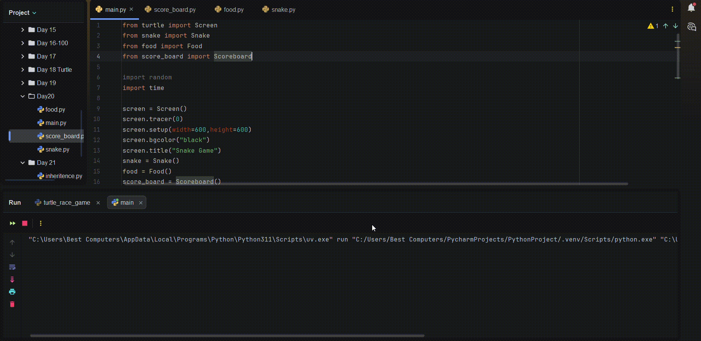

# Snake Game

A classic Snake game built with Python's `turtle` module. Control the snake with arrow keys, eat food to grow longer, and avoid hitting the walls or yourself.



## How It Works

1. The snake starts in the center of the screen.
2. Use the arrow keys to control direction — Up, Down, Left, Right.
3. Eating the blue food makes the snake grow by one segment and increases your score.
4. The game ends if the snake hits the wall or collides with its own body.

## Tech Used

- Python
- `turtle` (standard library)
- `random` (standard library)

## Run It Locally

```bash
python main.py
```

No external dependencies required — just a standard Python installation.

## License

Feel free to use, modify, or build on this project.
