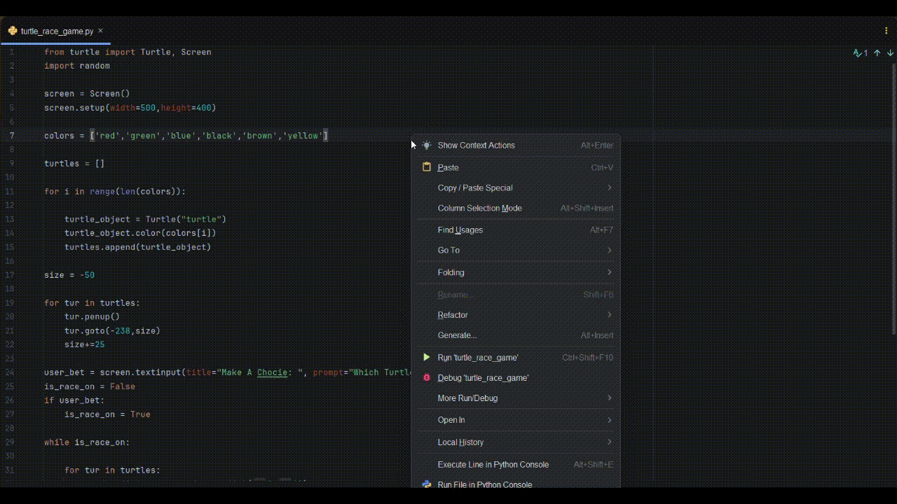

# 🐢 Turtle Race Betting Game

A simple Python game built with the `turtle` module. Six turtles line up, you bet on a color, and they race to the finish line at random speeds.



## How It Works

1. Six turtles (red, green, blue, black, brown, yellow) line up at the starting position.
2. You're prompted to guess which color will win.
3. Each turtle moves forward by a random distance every round.
4. The first turtle to cross the finish line wins — the game tells you if your bet was correct.

## Tech Used

- Python
- `turtle` (standard library)
- `random` (standard library)

## Run It Locally

```bash
python main.py
```

No external dependencies required — just a standard Python installation.

## License

Feel free to use, modify, or build on this project.
