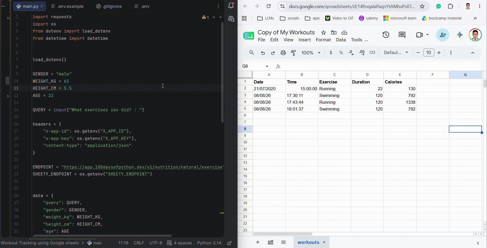

# Workout Tracker — Google Sheets Logger

A simple CLI tool that logs your workouts straight to a Google Sheet. Just describe what exercise you did in plain English — it's parsed automatically, calories burned are calculated, and the entry is appended to your sheet.

## How It Works

1. Run the script and type what exercise(s) you did in plain English, e.g. "ran 3 miles and did 30 minutes of yoga".
2. Your input is sent to the Nutritionix API, which parses it into individual exercises and estimates calories burned based on your stats (weight, height, age, gender).
3. Each exercise is logged as a new row — with date, time, exercise name, duration, and calories — to your connected Google Sheet via the Sheety API.
4. Open your sheet anytime to see your full workout history.

## Example

**Input:**

    What exercises you did? : ran 3 miles and swam for 20 minutes

**Result in Google Sheet:**

| Date | Time | Exercise | Duration | Calories |
|------|------|----------|----------|----------|
| 08/08/26 | 14:32:10 | Running | 30 | 300 |
| 08/08/26 | 14:32:10 | Swimming | 20 | 180 |

## Tech Used

- Python
- [Nutritionix API](https://developer.nutritionix.com/) — natural language exercise parsing & calorie estimation
- [Sheety API](https://sheety.co/) — turns a Google Sheet into a REST API
- requests — for making API calls
- python-dotenv — for managing API credentials securely

## Setup

**1. Clone the repo and install dependencies**

    pip install requests python-dotenv

**2. Create a .env file in the project root**

    NUTRITIONIX_APP_ID=your_app_id_here
    NUTRITIONIX_APP_KEY=your_app_key_here
    SHEETY_ENDPOINT=your_sheety_endpoint_here

See .env.example for the expected format. Get your Nutritionix credentials from the [Nutritionix Developer Portal](https://developer.nutritionix.com/) and your Sheety endpoint by connecting a Google Sheet at [sheety.co](https://sheety.co/).

**3. Update your personal stats**

In main.py, set your own stats — used to estimate calories burned accurately:

    GENDER = "male"
    WEIGHT_KG = 65
    HEIGHT_CM = 168
    AGE = 22

## Run It Locally

    python main.py

You'll be prompted to describe your workout — type it in and check your Google Sheet for the new entry.

## License

Feel free to use, modify, or build on this project.
